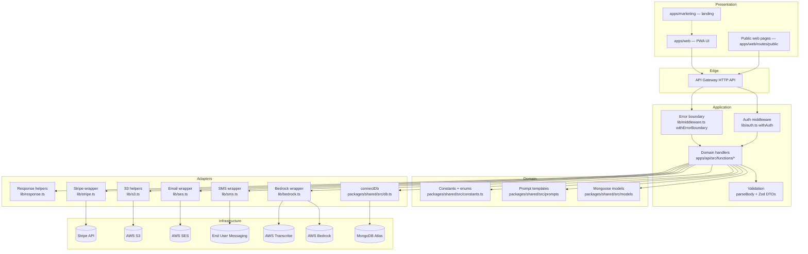
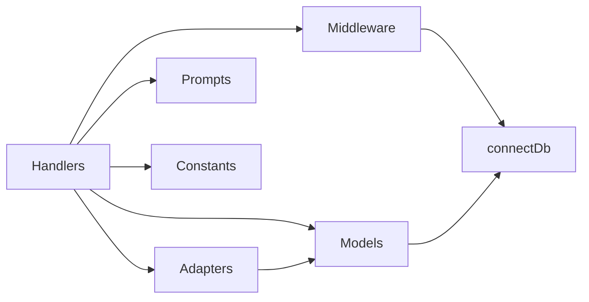

# Application Design — Lift

> **Approval**: Self-approved by orchestrator on 2026-05-24T21:15:00Z (autonomous run).

## Architectural Style

- **Serverless monolith** — single Lambda fleet behind one HTTP API Gateway, sharing a Mongoose connection. No microservice boundaries. Each handler is its own function but the deployable unit is the whole API.
- **Multi-tenant on a single MongoDB cluster** — tenants isolated by `shopId` on every document and every query. No per-tenant database.
- **Event-driven for SMS inbound and Stripe events** — these arrive via SNS topic and webhook respectively; otherwise the system is request/response.
- **Mobile-first PWA frontend** — installable from the browser, no native apps in v1.

## Layered View (logical)

## Components & Responsibilities

### Presentation Layer

| Component | Responsibility | Code path |
|---|---|---|
| Shop PWA | Authenticated owner UX: board, RO detail, customer detail, messaging, settings, onboarding | `apps/web/src/` |
| Marketing site | Cold-traffic conversion to trial signups | `apps/marketing/src/Landing.tsx` |
| Public pages | No-auth, token-scoped pages for Mike's customers (estimate, inspection, pay, book) | `apps/web/src/routes/public/` + `apps/api/src/functions/public/` |

### Application Layer (Lambda handlers)

| Component | Responsibility | Code path |
|---|---|---|
| Auth middleware | Extract JWT cookie, validate, populate `ctx.user` | `apps/api/src/lib/auth.ts` |
| Error boundary | Catch all unhandled errors, format error response, log | `apps/api/src/lib/middleware.ts` |
| Body validation | Zod schema parse on every body-accepting handler | `apps/api/src/lib/middleware.ts` `parseBody` |
| Domain handlers | One handler per route, grouped by domain folder | `apps/api/src/functions/*` |
| Response helpers | Standardized HTTP responses | `apps/api/src/lib/response.ts` |

### Domain Layer

| Component | Responsibility | Code path |
|---|---|---|
| Mongoose models | Schemas with hot-reload guard + per-shop indexes | `packages/shared/src/models/` |
| Bedrock prompts | Versioned prompt builders for draft + classify | `packages/shared/src/prompts/` |
| Constants | Status enums, plan price, TTLs | `packages/shared/src/constants.ts` |
| Zod DTOs | Request/response schemas; `e164` validator | `packages/shared/src/dto/` |

### Adapter Layer

| Component | Responsibility | Code path |
|---|---|---|
| `connectDb` | Cached `mongoose.connect`; called by middleware before handler runs | `packages/shared/src/db.ts` |
| Bedrock wrapper | Model selection (env-driven), `AiInteraction` logging (tokens, cost, duration) | `apps/api/src/lib/bedrock.ts` |
| SMS wrapper | End User Messaging primary; SES email fallback when `MOCK_SMS=1` | `apps/api/src/lib/sms.ts` |
| Email wrapper | SES send | `apps/api/src/lib/ses.ts` |
| S3 helpers | Presigned URL generation, getObject, putObject | `apps/api/src/lib/s3.ts` |
| Stripe wrapper | Stripe SDK client + helpers | `apps/api/src/lib/stripe.ts` |

### Infrastructure Layer

All defined in `sst.config.ts`:
- 1 API Gateway HTTP API
- ~70 Lambda functions
- 1 S3 bucket (photos)
- 1 CloudFront distribution (photos CDN)
- 1 SNS topic (SmsInboundTopic) + subscription to `webhooks/snsInbound`
- IAM permissions bundle (`commonPermissions`)
- Environment variables (`commonEnv`)
- 8 secrets bound from SST secret store

## Component Dependencies

## Cross-cutting Concerns

| Concern | Implementation |
|---|---|
| Multi-tenancy | `ctx.user.shopId` filter on every query; `withAuth` populates ctx; body-supplied shopIds ignored |
| Money | Integer cents everywhere; formatted client-side |
| Phone | `e164` Zod validator at API boundary |
| AI cost tracking | Every Bedrock call logs `AiInteraction` with token + cost + duration; per-RO guardrail <$0.05 |
| SMS idempotency / opt-out | `Customer.smsOptOutAt` flag respected on every outbound send |
| Stripe webhook idempotency | Dedup by `stripeEventId` via `SubscriptionEvent` collection insert |
| Hot-reload model guard | `mongoose.models.X || mongoose.model(...)` pattern in every model file |

## Why this architecture

1. **Serverless is the right cost shape for v1.** Per-shop traffic is low (a 1-bay shop generates dozens, not thousands, of requests per day). Lambda pay-per-invocation maps directly to Lift's flat $79/mo revenue. As Lift adds shops, costs scale roughly linearly with revenue — no fixed compute overhead.
2. **MongoDB over DynamoDB** because schema flexibility matters during product iteration and because Mongoose familiarity reduces ramp-up for whoever joins. Trade-off: cold-start latency to Atlas is a hit on first request. Mitigated by `connectDb` connection cache.
3. **No third-party auth.** Magic-link + JWT cookie removes a recurring per-MAU bill and a vendor coupling. Trade-off: we own the magic-link plumbing.
4. **Bedrock Haiku for both draft + classify** keeps per-RO AI cost within budget while remaining a Claude family model (Anthropic-curated quality). Sonnet would blow the cost guardrail.
5. **PWA over native.** Lower build/deploy complexity; works on the phone Mike already has. Trade-off: no native push notifications today — push is via PWA web-push.

## Design decisions vs. alternatives

| Decision | Alternative | Why chosen |
|---|---|---|
| Mongoose | DynamoDB + single-table | Schema iteration speed; team familiarity |
| Magic-link + JWT cookie | Cognito / Clerk / Auth0 | Cost, no vendor coupling, owner-aligned |
| Per-shop Lambda (shared deployment) | Per-tenant Lambda | Overkill at v1 scale; revisit if a tenant ever needs isolation |
| End User Messaging + SES fallback | Twilio | AWS-native — single billing surface; Twilio could be added if EUM doesn't meet quality |
| pnpm monorepo | Yarn workspaces / Nx / Turborepo | Lightest weight; SST plays well with pnpm |
| SST v3 | CDK direct / Serverless Framework | SST is purpose-built for the same shape we have (Lambdas + frontends + bindings) |
