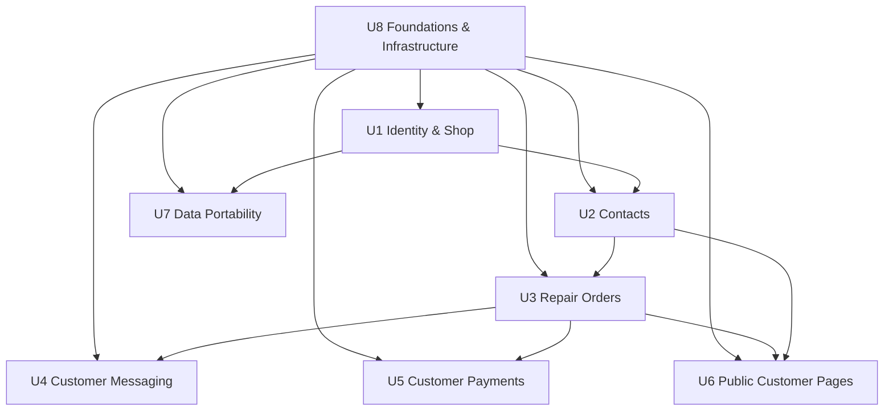

# Units of Work — Lift

> **Approval**: Self-approved by orchestrator on 2026-05-24T21:25:00Z (autonomous run).

The Lift system decomposes into **8 units of work**. Each unit gets one consolidated Construction-phase doc covering functional design, NFR requirements, NFR design, infrastructure design, and code map (per the workflow plan, per-unit docs are minimal because code already exists).

## Decomposition principles

- **Bounded business capability** — each unit corresponds to a coherent set of user stories.
- **Sized to fit in one doc** — each unit's Construction doc is ~80–150 lines.
- **Independently testable** — each unit's behavior can be exercised end-to-end without depending on every other unit.

## Units

| ID | Unit | Stories covered | Primary code path |
|---|---|---|---|
| U1 | **Identity & Shop** | US-A1, US-A2, US-A3, US-H1, US-H2 | `apps/api/src/functions/{auth,onboard,shop,billing}` |
| U2 | **Contacts** (customers + vehicles) | US-B2 (parts) | `apps/api/src/functions/{customers,vehicles}` |
| U3 | **Repair Orders** | US-B1, US-B2, US-B3, US-B4, US-B5, US-B6, US-D1, US-D3 | `apps/api/src/functions/{repairOrders,jobTemplates,lookup}` |
| U4 | **Customer Messaging** | US-C1, US-C2, US-C3, US-C4, US-G1, US-G2, US-G3 | `apps/api/src/functions/{messages,webhooks/snsInbound,webhooks/snsDelivery,serviceReminders}` |
| U5 | **Customer Payments** | US-E1, US-E2, US-E3 | `apps/api/src/functions/{payments,webhooks/stripe}` |
| U6 | **Public Customer Pages** | US-D2, US-F1, US-F2, US-F3, US-I1, US-I2, US-I3 | `apps/api/src/functions/public/*`, `apps/web/src/routes/public/*` |
| U7 | **Data Portability** | US-H3 | `apps/api/src/functions/data/export.ts` |
| U8 | **Foundations & Infrastructure** | (cross-cutting; supports all stories) | `packages/shared/src/*`, `apps/api/src/lib/*`, `sst.config.ts`, `apps/web/`, `apps/marketing/` |

## Dependency graph

U8 (Foundations) is the prerequisite for every other unit. U1 (Identity) gates everything authenticated. U2 (Contacts) is referenced by U3, U6. U3 (ROs) is referenced by U4, U5, U6.

## Construction order (recommended)

1. U8 — Foundations & Infrastructure (must be solid before any feature work)
2. U1 — Identity & Shop
3. U2 — Contacts
4. U3 — Repair Orders
5. U4 — Customer Messaging (depends on U3 for RO state)
6. U5 — Customer Payments (depends on U3 for RO totals)
7. U6 — Public Customer Pages (depends on U2, U3)
8. U7 — Data Portability (independent; last because it scans all collections)

For this autonomous run, all unit docs are produced in parallel since the code already exists. Construction order is a recommendation for any future feature work that touches multiple units.
