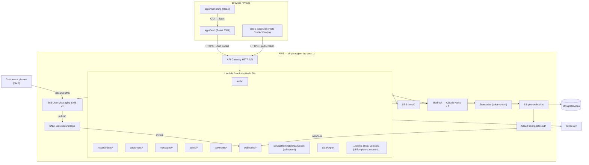
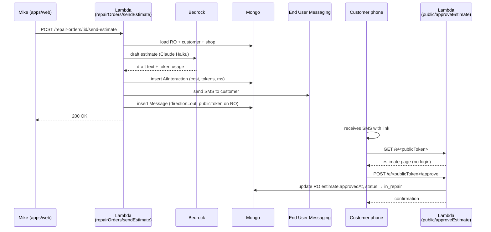
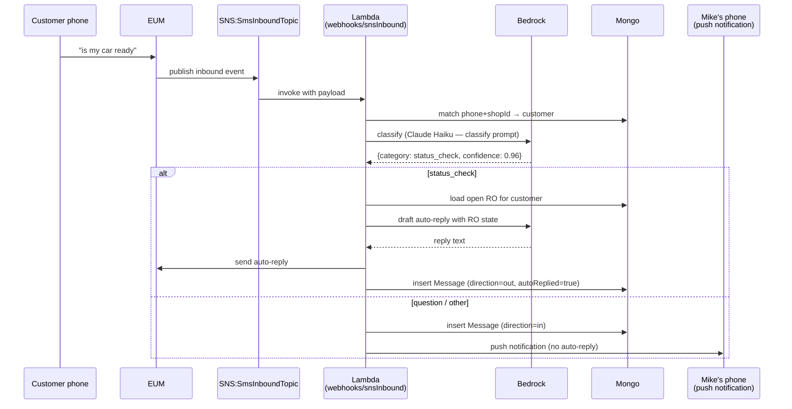

# System Architecture — Lift

## System Overview

Lift is a serverless, multi-tenant, mobile-first SaaS on AWS. The frontend is a React PWA (and a separate marketing site). The backend is a fleet of AWS Lambda functions behind an HTTP API Gateway, persisting to MongoDB Atlas. AI is AWS Bedrock (Claude Haiku 4.5 for both drafting and classification, on cross-region inference profiles). Two-way SMS is AWS End User Messaging SMS v2; inbound messages publish to an SNS topic that a Lambda subscribes to. Email is AWS SES. Photos and voice memos live in S3 behind CloudFront. Payments are Stripe (both Lift's own subscription and the customer-payment links Mike's shop sends). Auth is a custom magic-link + JWT-cookie flow — no third-party identity.

## Architecture Diagram



## Component Descriptions

| Component | Purpose | Dependencies | Type |
|---|---|---|---|
| `apps/web` | Shop PWA — board, RO detail, customer detail, messages, settings, onboarding | API Gateway, browser PWA APIs, Mantine v7, TanStack Query | Application |
| `apps/marketing` | Landing site (`lift.worxel.com`) | Static asset hosting (CloudFront via SST) | Application |
| `apps/api` | Lambda handlers — REST + public + webhooks + scheduled | Mongoose, AWS SDKs, Stripe SDK, Zod | Application |
| `packages/shared` | Mongoose models, Zod DTOs, Bedrock prompt builders, constants, `connectDb` | mongoose, zod | Models / shared library |
| `sst.config.ts` | All AWS infra | sst, aws-cdk | Infrastructure (IaC) |
| MongoDB Atlas | Primary data store — 12 collections | n/a | External data store |
| AWS Bedrock | LLM for draft + classify; uses cross-region inference profiles | n/a | External AI service |
| AWS End User Messaging | Two-way SMS provisioning + send. Inbound via SNS. | n/a | External SMS service |
| AWS SES | Outbound email (magic link, mock-SMS fallback) | n/a | External email service |
| Stripe | Lift subscription billing + customer payment links | webhook into `webhooks/stripe.ts` | External payment service |
| AWS S3 + CloudFront | Photo storage + delivery + voice memo storage for Transcribe | IAM + signed/presigned URLs | Infrastructure |
| AWS Transcribe | Voice memo → text for Voice-to-RO | reads from photos bucket | External AI service |

## Data Flow — key workflows

### Workflow 1: AI-drafted estimate sent via SMS (BT-5 + BT-6)



### Workflow 2: Inbound customer SMS — auto-reply to status check (BT-7)



### Workflow 3: Customer pays for RO via Stripe link (BT-10)

```mermaid
sequenceDiagram
    participant Mike as Mike (apps/web)
    participant API as Lambda<br/>(payments/createLink)
    participant Stripe
    participant Mongo
    participant Customer as Customer phone
    participant PubAPI as Lambda<br/>(public/pay)
    participant Hook as Lambda<br/>(webhooks/stripe)

    Mike->>API: POST /payments/link (roId)
    API->>Stripe: create PaymentIntent / Checkout Session
    API->>Mongo: insert Payment (status=pending)
    API-->>Mike: pay URL
    Mike->>Customer: send pay URL via SMS
    Customer->>PubAPI: GET /pay/<publicToken>
    PubAPI-->>Customer: pay page
    Customer->>Stripe: confirm payment
    Stripe-->>Hook: webhook (payment_intent.succeeded)
    Hook->>Mongo: dedupe by stripeEventId; update Payment.status=paid, RO=picked_up
```

## Integration Points

**External APIs / services:**
- **AWS Bedrock** — Claude Haiku 4.5 via cross-region inference profile (`us.anthropic.claude-haiku-4-5`). Used for both drafting and classification today.
- **AWS End User Messaging SMS v2** — two-way SMS, dedicated number per shop, inbound via SNS topic subscription.
- **AWS SES** — magic-link email; also used as mock-SMS recipient while 10DLC is in review (`MOCK_SMS=1` flag in `sst.config.ts`).
- **AWS Transcribe** — voice-to-RO; reads memo from S3 photos bucket.
- **AWS S3 + CloudFront** — photo and voice-memo storage / delivery.
- **Stripe** — Lift subscription (Customer + Subscription + Webhook) AND customer payment links (PaymentIntent + Customer + saved cards).
- **MongoDB Atlas** — single replica set, cached `mongoose.connect` connection.

**No external auth provider** — magic-link email + SMS code fallback is implemented in `apps/api/src/functions/auth/`.

## Infrastructure Components

- **SST v3** is the IaC framework (`sst.config.ts`). VPC-less stack.
- **Removal policy**: `retain` on prod.
- **Secrets** (set via `sst secret set`): `MongodbUri`, `JwtSecret`, `StripeSecretKey`, `StripePublishableKey`, `StripeWebhookSecret`, `StripePriceLift79`, `SesFromEmail`, `SmsPoolId`.
- **Common env vars** (set in `sst.config.ts` `commonEnv`): `BEDROCK_REGION`, `BEDROCK_MODEL_DRAFT`, `BEDROCK_MODEL_CLASSIFY`, `MOCK_SMS=1` (temporary).
- **Common IAM permissions** (`commonPermissions`): `bedrock:InvokeModel`, `ses:SendEmail`, `sms-voice:SendTextMessage`, `transcribe:StartTranscriptionJob`, `transcribe:GetTranscriptionJob`, `s3:GetObject` on the photos bucket.
- **CDN**: CloudFront in front of the photos S3 bucket; custom domain handled in SST config.
- **Networking**: no VPC. Lambdas access MongoDB Atlas via TLS over the public internet (Atlas allowlist).

## Notable architectural decisions

1. **Serverless-everywhere** — no long-running services. Trade-off: cold-start latency on rarely-used endpoints, but operationally simple and cheap at Lift's scale.
2. **MongoDB over DynamoDB** — schema flexibility for the iterating data model; Mongoose familiarity. Atlas managed.
3. **No third-party auth** — magic link + JWT cookie keeps the auth surface owner-aligned (no per-MAU pricing risk, no vendor coupling).
4. **Bedrock Haiku for both draft + classify** — keeps per-RO AI cost under the $0.05 guardrail (see `aiInteractions` collection).
5. **Mock SMS via SES** — while AWS End User Messaging 10DLC campaign is in review, outbound SMS routes through SES emails. Flag is environmental (`MOCK_SMS=1`); flip off when 10DLC clears.
6. **PWA over native** — phone-first UX without dual app builds. Listed in deferred features: native iOS/Android (post-v1).
