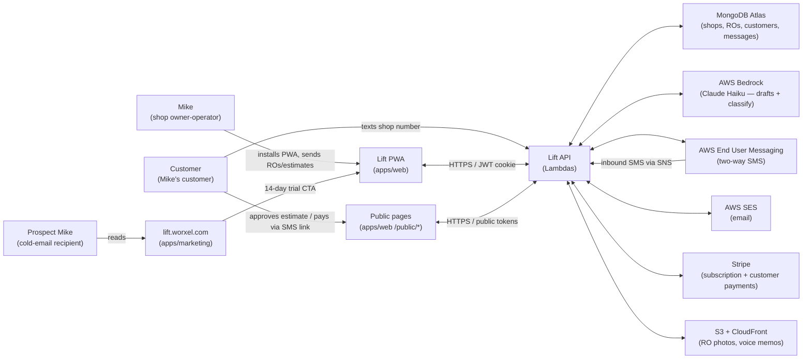

# Business Overview — Lift

> **Source of truth**: [`docs/PLAN.md`](../../../docs/PLAN.md). This document derives from PLAN.md and the existing codebase as of 2026-05-24.
> **Audience**: [`docs/PERSONA.md`](../../../docs/PERSONA.md) — "Mike, the owner-operator".

## Business Context Diagram

## Business Description

**What Lift does:** Lift is a single-tenant-per-shop SaaS that gives a 1–3 bay independent auto repair shop owner a phone-first tool to run their shop. The product's wedge is **AI-handled inbound customer SMS** — the most-painful daily interruption for the persona — paired with the minimum surrounding tooling (repair orders, photo inspections, payment links, online booking) to deliver a complete shop-management surface at one flat monthly price.

**Why Lift exists:** Mike is overserved by competitors built for 10-bay multi-location shops with a dedicated service advisor (Shopmonkey, AutoLeap, Tekmetric, Mitchell 1). Those tools cost $200–$400/mo, take days to set up, and assume workflows Mike doesn't have. Lift trades feature breadth for fit: it does one thing well — keep Mike in the bay — and prices it at a flat $79/mo with no per-tech, per-message, or per-RO fees.

**Business model:** Self-serve Stripe subscription at **$79/mo flat** after a **14-day no-card trial**. Per-shop SMS dedicated number provisioned through AWS End User Messaging. Card processing on customer payments is passed through at Stripe cost (separate revenue stream Mike collects from his own customers).

## Business Transactions

Lift implements the following business transactions end-to-end. Each maps to one or more code paths in `apps/api/src/functions/`.

| # | Transaction | Trigger | Code path(s) |
|---|---|---|---|
| BT-1 | Shop owner signs up + trial starts | Owner enters email on marketing site | `auth/magicLink.ts` → `auth/verify.ts` → `onboard/shop.ts` |
| BT-2 | SMS number provisioning + verification | Owner completes onboarding | `onboard/shop.ts`, `onboard/smsVerify.ts` |
| BT-3 | Subscription activation (post-trial) | Stripe checkout / portal | `onboard/stripeSetup.ts`, `webhooks/stripe.ts`, `billing/portal.ts` |
| BT-4 | Repair Order lifecycle (in → in_repair → ready → picked_up) | Owner creates RO from a customer | `repairOrders/create.ts`, `repairOrders/patch.ts`, `repairOrders/lineItems.ts` |
| BT-5 | AI-drafted estimate sent via SMS | Owner taps "Send estimate" | `repairOrders/sendEstimate.ts` → `bedrock.ts` (draft) → `sms.ts` (send) |
| BT-6 | Customer approves estimate from SMS link | Customer taps public link | `public/getEstimate.ts`, `public/approveEstimate.ts`, `public/declineEstimate.ts` |
| BT-7 | Inbound customer SMS — auto-reply to status checks | Customer texts shop number | `webhooks/snsInbound.ts` → `bedrock.ts` (classify) → conditional auto-reply via `sms.ts` |
| BT-8 | Voice-to-RO (mechanic dictates job, AI structures it) | Owner records voice memo | `repairOrders/voicePresign.ts` (S3 upload) → `repairOrders/voiceToRo.ts` (AWS Transcribe + Bedrock) |
| BT-9 | Photo inspection sent to customer | Owner publishes inspection | `repairOrders/photosPresign.ts`, `repairOrders/photosConfirm.ts`, `repairOrders/sendInspection.ts`, public side: `public/getInspection.ts` |
| BT-10 | Customer pays for RO via SMS link | Owner taps "Send pay link", customer taps + pays | `payments/createLink.ts`, `payments/charge.ts`, `payments/saveCard.ts`, public: `public/getPay.ts`, `public/pay.ts`, webhook: `webhooks/stripe.ts` |
| BT-11 | Customer books appointment online | Customer visits shop booking link | `public/getBook.ts`, `public/getBookSlots.ts`, `public/book.ts`, `public/cancelBooking.ts`, `public/rescheduleBooking.ts` |
| BT-12 | Service-due reminder (per-customer, per-vehicle, time-based) | Daily scheduled scan | `serviceReminders/dailyScan.ts`, `serviceReminders/list.ts`, `serviceReminders/patch.ts` |
| BT-13 | Manual customer message draft + send | Owner taps "Message" | `messages/draft.ts` → Bedrock → `messages/send.ts` |
| BT-14 | Customer history / vehicle history view | Owner opens detail page | `customers/history.ts`, `vehicles/history.ts` |
| BT-15 | Data export (CSV of all shop data) | Owner taps export | `data/export.ts` |
| BT-16 | Job template (saved-job) apply | Owner adds saved job to RO | `jobTemplates/list.ts`, `jobTemplates/apply.ts`, `jobTemplates/create.ts`, etc. |
| BT-17 | Vehicle VIN decode | Owner enters VIN | `vehicles/decodeVin.ts` (with `VinDecodeCache`) |

## Business Dictionary

| Term | Definition |
|---|---|
| **RO** | Repair Order. A unit of work at the shop on one vehicle. Always written uppercase. Has status `in / in_repair / ready / picked_up`. |
| **Mike** | Persona name for the canonical Lift user (1–3 bay shop owner-operator). See [`docs/PERSONA.md`](../../../docs/PERSONA.md). |
| **Shop** | The tenant. One Stripe subscription = one shop = one SMS number = one timezone. |
| **Bay** | A stall in the shop. "1–3 bay" is the segment Lift serves. |
| **SA** | Service Advisor — the staff role that handles customer communication at larger shops. Mike doesn't have one; Lift's AI fills that gap. |
| **Wedge** | The single most-painful problem Lift solves: inbound "is my car ready" SMS overhead. |
| **Estimate** | Quote sent to the customer as an SMS with a tap-to-approve link. |
| **Inspection** | A photo-driven inspection with green/yellow/red items the customer reviews via SMS link. |
| **Job Template** | A pre-saved labor + parts bundle the owner can drop onto an RO in two taps. |
| **Auto-reply** | The AI's response to inbound SMS classified as a status check. Flagged `autoReplied=true`; owner can review or disable. |
| **AI Interaction** | Logged record of every Bedrock call: prompt, output, input/output tokens, cost in cents, duration. Used for the <$0.05/RO cost guardrail. |
| **Public token** | Random unguessable token attached to an RO (or booking) that lets a customer approve/pay without logging in. |
| **10DLC** | The US SMS provisioning regime for branded business texting. Required before real SMS sends. Currently bypassed via `MOCK_SMS=1` → SES email fallback. |
| **Cents-money** | All monetary fields are stored as integer cents (no floats). Formatted client-side via `lib/format.ts`. |

## Component-Level Business Descriptions

### `apps/api` — Backend (AWS Lambda + SST v3)
- **Purpose**: All business logic, data persistence, and AWS-service orchestration.
- **Responsibilities**: REST API for the web app + public token endpoints + webhook handlers + scheduled jobs. Owns the Mongoose connection, Bedrock prompts, SMS/SES routing, Stripe integration.

### `apps/web` — Shop PWA (React + Vite + Mantine v7)
- **Purpose**: The authenticated shop app Mike installs on his phone.
- **Responsibilities**: All in-shop UX — board view, RO detail, customer detail, messaging, settings, onboarding flow. PWA installable; works offline for cached board view.

### `apps/marketing` — Landing site (React + Vite + Mantine v7)
- **Purpose**: Convert cold-email and direct traffic to trial signups at `lift.worxel.com`.
- **Responsibilities**: Single-page marketing site with hero, wedge demo, anti-persona, features, pricing, FAQ, final CTA. All CTAs UTM-tagged and routed to the app's `/login`.

### `packages/shared` — Cross-app types and contracts
- **Purpose**: Single source of truth for data shapes — Mongoose models, Zod DTOs, prompt templates, status enums, plan price.
- **Responsibilities**: Models (12 Mongoose schemas), Zod validators (`src/dto/`), versioned Bedrock prompts (`src/prompts/`), constants (`src/constants.ts`), and the cached `connectDb()` helper.

### `sst.config.ts` — Infrastructure-as-code (root)
- **Purpose**: All AWS infrastructure (Lambdas, HTTP API, S3, CloudFront, SNS topic, IAM, secrets) defined as code via SST v3.
- **Responsibilities**: VPC-less stack. Provisions every Lambda, the API Gateway HTTP API, S3 photos bucket + CloudFront distribution, the SmsInboundTopic SNS topic, and binds Stripe/Mongo/JWT/SES secrets to runtime env vars.

## Notes / Conventions

- **Multi-tenancy**: Every collection except `users` and `VinDecodeCache` has `shopId`. Every query path filters by `shopId` from the session — never a body-supplied `shopId`. (See [`CLAUDE.md`](../../../CLAUDE.md).)
- **Money is cents**: All monetary fields are integer cents.
- **Phone is E.164**: All phone fields validated at the boundary with `e164` from `@lift/shared/dto`.
- **Stripe webhook idempotency**: Dedup by `stripeEventId`. Don't remove `SubscriptionEvent` insert.
- **Mongoose model overwrite guard**: Always use `mongoose.models.X || mongoose.model(...)` pattern in dev to avoid hot-reload errors.
