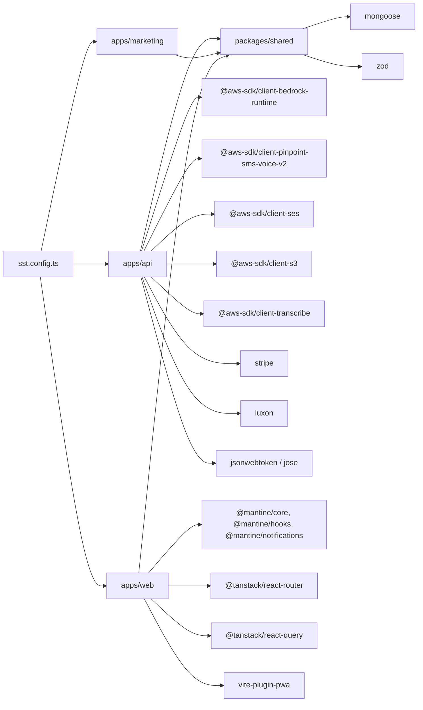

# Technology Stack & Dependencies — Lift

## Languages & Runtimes

| Layer | Language | Runtime | Notes |
|---|---|---|---|
| Backend (Lambdas) | TypeScript | Node 20 | Required — `vite-plugin-pwa` and Bedrock SDK both break on Node 18 |
| Frontend (PWA + Marketing) | TypeScript | Browser (modern) | React 18 |
| Shared package | TypeScript | both | strict mode, ESM, NodeNext |
| Infrastructure | TypeScript | sst v3 | Node runtime for synth |

## Core Frameworks

| Concern | Library | Version | Why |
|---|---|---|---|
| Web framework (Lambda) | none (raw `APIGatewayProxyHandlerV2`) | n/a | Keep Lambda code minimal; middleware via local helpers |
| Frontend UI library | Mantine v7 | 7.x | Component-rich, accessible, dark-mode native; shared theme between web and marketing |
| Frontend routing | TanStack Router (file routes) | latest | Type-safe routing |
| Frontend data fetching | TanStack Query | latest | Cache + retries + suspense |
| Frontend forms | Mantine `use-form` | bundled | Simple, sufficient for v1 |
| Validation | Zod | latest | Shared between API and web (one schema, both sides) |
| ODM | Mongoose | latest | Required by team familiarity; pairs with MongoDB Atlas |
| PWA tooling | `vite-plugin-pwa` (+ workbox) | latest | Service worker + manifest for "install to home screen" |
| Build (frontends) | Vite | latest | Fast dev server, esbuild-backed |
| Build (Lambdas) | esbuild via SST | bundled | Tree-shake + ESM-out |
| Infra-as-code | SST v3 | latest | All AWS infra in `sst.config.ts` |
| Email | nodemailer (via SES SMTP) OR `@aws-sdk/client-ses` | bundled | One of these is the path in `apps/api/src/lib/ses.ts` |
| Payments | `stripe` Node SDK | latest | Subscription + Customer + PaymentIntent + Webhook |
| SMS | `@aws-sdk/client-pinpoint-sms-voice-v2` (End User Messaging) | latest | Two-way SMS; SES fallback when `MOCK_SMS=1` |
| AI / LLM | `@aws-sdk/client-bedrock-runtime` | latest | Claude Haiku 4.5 via inference profile |
| Transcribe | `@aws-sdk/client-transcribe` | latest | Voice-to-RO step 1 |
| S3 | `@aws-sdk/client-s3` | latest | Photo + voice memo storage |
| JWT | `jsonwebtoken` (or `jose`) | latest | HS256 with `JwtSecret`; HTTP-only cookie |
| Date math | `luxon` (per `public/book.ts`) | latest | Timezone-aware (shops have timezones) |
| Money formatting | Local helper `lib/format.ts` | n/a | Integer cents → display strings |
| Phone validation | `libphonenumber-js` (per PLAN.md "E.164") | latest | Strict E.164 at API boundary |

## External Services / SaaS

| Service | Tier / Plan | Purpose |
|---|---|---|
| MongoDB Atlas | Shared cluster (M0/M10 for v1) | Primary data store |
| AWS Bedrock | Pay-per-token (Haiku 4.5) | LLM — draft + classify |
| AWS End User Messaging SMS v2 | Per-message | Two-way SMS |
| AWS SES | Pay-per-email | Magic-link emails + mock-SMS fallback |
| AWS Transcribe | Per-second-billed | Voice-to-RO |
| AWS S3 | Pay-per-GB + requests | Photo + voice storage |
| AWS CloudFront | Pay-per-GB + requests | Photo CDN |
| AWS Lambda | Pay-per-invocation + duration | All compute |
| AWS API Gateway (HTTP API) | Pay-per-request | API routing |
| AWS SNS | Pay-per-message | Inbound SMS fan-out |
| Stripe | Per-transaction | Subscriptions + customer payments |

## Dependencies (logical, derived from imports + PLAN.md)

## Environment / Secrets Surface

| Secret (SST) | Used by | Notes |
|---|---|---|
| `MongodbUri` | api (`packages/shared/db.ts`) | Atlas connection string |
| `JwtSecret` | api (`lib/auth.ts`) | HS256 signing key |
| `StripeSecretKey` | api (`lib/stripe.ts`) | Server-side Stripe SDK |
| `StripePublishableKey` | web | Stripe Elements / Checkout client |
| `StripeWebhookSecret` | api (`webhooks/stripe.ts`) | Webhook signature verify |
| `StripePriceLift79` | api (`onboard/stripeSetup.ts`) | The $79/mo plan price ID |
| `SesFromEmail` | api (`lib/ses.ts`) | Verified sender address |
| `SmsPoolId` | api (`lib/sms.ts`) | End User Messaging pool ID |

| Env var (commonEnv) | Used by | Default |
|---|---|---|
| `BEDROCK_REGION` | api | `us-east-1` |
| `BEDROCK_MODEL_DRAFT` | api | `us.anthropic.claude-haiku-4-5` |
| `BEDROCK_MODEL_CLASSIFY` | api | `us.anthropic.claude-haiku-4-5` |
| `MOCK_SMS` | api | `1` (until 10DLC clears) |

## Notable version gotchas

- **Node 20 mandatory.** `vite-plugin-pwa` fails on Node 18 with "Dynamic require of workbox-build is not supported" / "crypto is not defined".
- **`.npmrc` must contain `public-hoist-pattern[]=*workbox*`** — pnpm + workbox-build interaction.
- **Bedrock model IDs**: cannot use bare `anthropic.claude-*` IDs on-demand. Must use cross-region inference profile prefix matching the deploy region (`us.anthropic.claude-haiku-4-5`, `eu.anthropic.…`, `apac.anthropic.…`).
- **Mongoose model overwrite errors** in dev — the `mongoose.models.X || mongoose.model(...)` guard is mandatory per CLAUDE.md.
- **Stripe webhook idempotency**: dedup by `stripeEventId`; never remove the `SubscriptionEvent` insert.
- **Voice-to-RO uses Transcribe + Bedrock, not direct audio→LLM** — Bedrock Claude doesn't accept audio input today. Lambda IAM needs `transcribe:StartTranscriptionJob`, `transcribe:GetTranscriptionJob`, and `s3:GetObject` on the photos bucket (already in `commonPermissions`).
